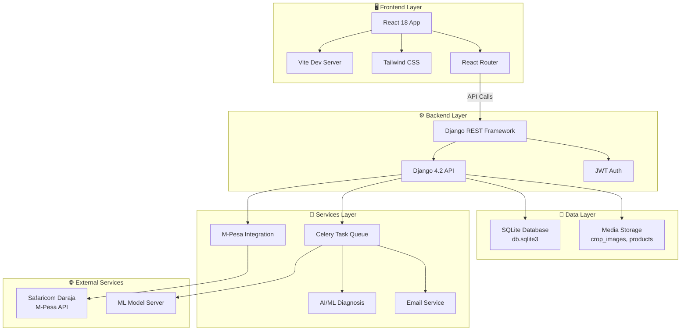
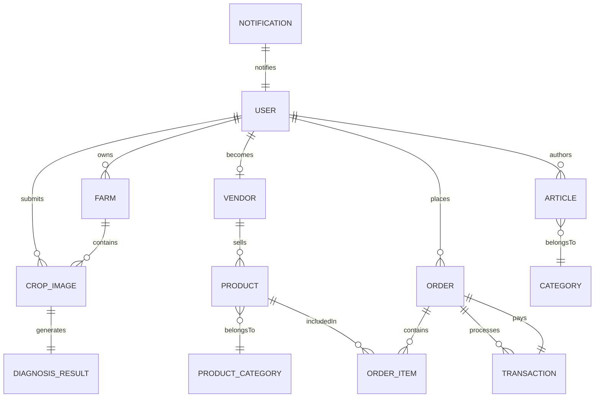
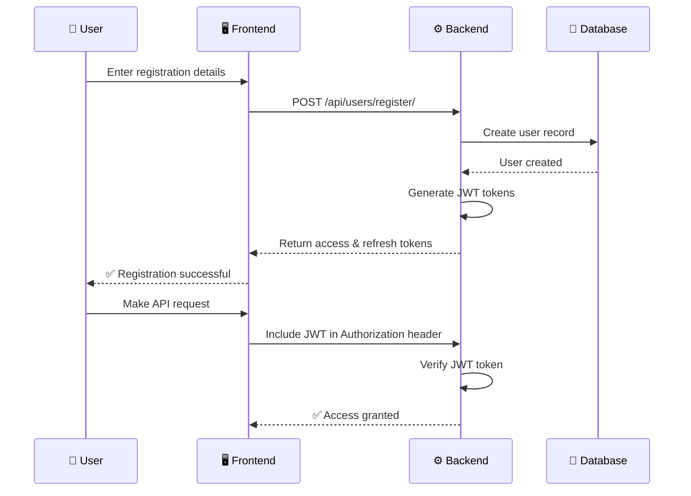
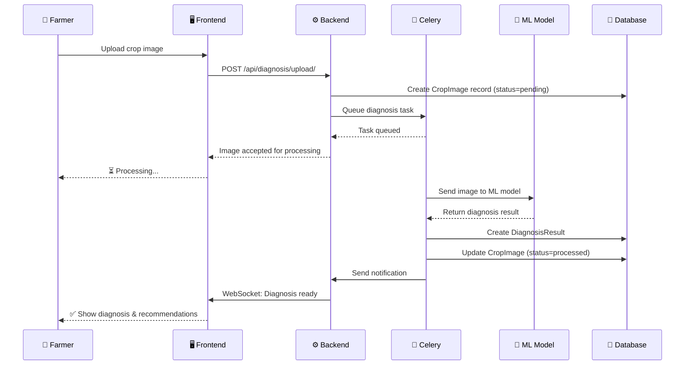
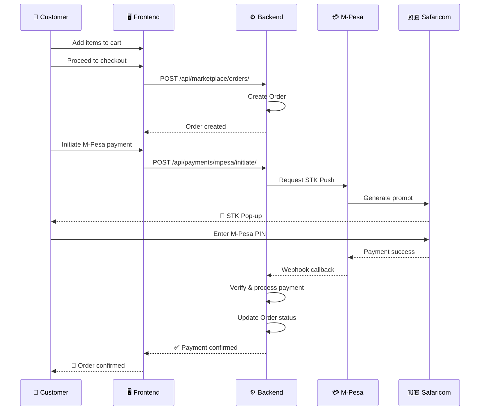

# 🌾 DigiFarm Assist

> **Empowering African Farmers with AI-Powered Agricultural Intelligence**

A production-ready full-stack web application revolutionizing agricultural assistance through intelligent crop diagnosis, seamless marketplace integration, and comprehensive farming knowledge hub. Built with Django REST Framework backend and React frontend.

---

## ✨ Core Features

| Feature | Description | 
|---------|-------------|
| 🤖 **AI Crop Diagnosis** | Upload crop images for instant AI-powered disease detection with smart treatment recommendations |
| 🛒 **Agricultural Marketplace** | Browse, compare, and purchase seeds, fertilizers, pesticides, and equipment from verified vendors |
| 📚 **Knowledge Hub** | Access expert-curated articles, best practices, and farming guides by category |
| 💳 **M-Pesa Integration** | Seamless Safaricom Daraja API payment processing for secure transactions |
| 🗺️ **Farm Management** | Track multiple farms, plots, crops, soil conditions, and farm metadata |
| 📱 **Mobile-First Design** | Fully responsive UI optimized for all devices (Mobile, Tablet, Desktop) |
| 🔔 **Smart Notifications** | Real-time in-app and email notifications for orders, diagnoses, and updates |
| 🔐 **JWT Authentication** | Industry-standard token-based API authentication with role-based access control |
| 👥 **Community Features** | Connect with other farmers, share experiences, and collaborate |

---

## 🏗️ System Architecture



---

## 🗄️ Database Schema



---

## 📊 Application Modules & Features

### 1. 👥 **Users Module** (`apps/users`)
- ✅ Custom user model with email as primary identifier
- ✅ Role-based access (Farmer, Vendor, Admin)
- ✅ Phone number validation (Kenya +254 format)
- ✅ Profile management & picture uploads
- ✅ Email verification system
- ✅ JWT-based authentication

### 2. 🚜 **Farms Module** (`apps/farms`)
- ✅ Create and manage multiple farms
- ✅ Farm metadata (location, size, soil type)
- ✅ GPS coordinates (latitude/longitude)
- ✅ Main crops tracking with JSON storage
- ✅ Farm history and updates

### 3. 🔬 **Diagnosis Module** (`apps/diagnosis`)
- ✅ Upload crop images for analysis
- ✅ AI-powered disease detection
- ✅ Confidence scoring system
- ✅ Treatment recommendations engine
- ✅ Async task processing via Celery
- ✅ Results tracking and history

### 4. 🛍️ **Marketplace Module** (`apps/marketplace`)
- ✅ Product catalog management
- ✅ Product categories (Seeds, Fertilizers, Equipment, etc.)
- ✅ Vendor profiles & verification
- ✅ Shopping cart functionality
- ✅ Order management system
- ✅ Inventory tracking
- ✅ Rating & review system

### 5. 💳 **Payments Module** (`apps/payments`)
- ✅ M-Pesa STK Push integration
- ✅ Transaction tracking
- ✅ Payment status monitoring
- ✅ Webhook handling for payment callbacks
- ✅ Error logging and retry mechanisms
- ✅ Transaction history

### 6. 📚 **Knowledge Module** (`apps/knowledge`)
- ✅ Article management system
- ✅ Category-based organization
- ✅ Markdown support for rich content
- ✅ Search and filtering capabilities
- ✅ View tracking
- ✅ Featured image support
- ✅ Tag-based discovery

### 7. 🔔 **Notifications Module** (`apps/notifications`)
- ✅ Email notifications
- ✅ In-app notifications
- ✅ Order status updates
- ✅ Diagnosis results alerts
- ✅ Payment confirmations

### 8. 👫 **Community Module** (`apps/community`)
- ✅ User interaction features
- ✅ Experience sharing
- ✅ Farmer networking

---

## 🛠️ Tech Stack

### Backend Stack
| Component | Technology | Version |
|-----------|-----------|---------|
| **Framework** | Django REST Framework | 4.2.7 |
| **Database** | SQLite | Built-in |
| **Task Queue** | Celery | 5.3.4 |
| **Message Broker** | Redis | 5.0.1 |
| **Authentication** | JWT (djangorestframework-simplejwt) | 5.3.0 |
| **API Documentation** | drf-spectacular | 0.26.5 |
| **File Storage** | django-storages + Pillow | 10.1.0 |
| **Testing** | pytest + pytest-django | 7.4.3 |

### Frontend Stack
| Component | Technology | Version |
|-----------|-----------|---------|
| **Framework** | React | 18.2.0 |
| **Build Tool** | Vite | 5.0.8 |
| **Styling** | Tailwind CSS | 3.3.6 |
| **Routing** | React Router DOM | 6.20.0 |
| **HTTP Client** | Axios | 1.6.2 |
| **Animations** | Framer Motion | 10.16.16 |
| **Notifications** | React Hot Toast | 2.4.1 |

### Infrastructure & Tools
| Tool | Purpose | Version |
|------|---------|---------|
| **Docker** | Containerization | Latest |
| **Docker Compose** | Multi-container orchestration | 3.8+ |
| **pytest** | Backend testing | 7.4.3 |
| **Flower** | Celery task monitoring | Latest |
| **ngrok** | Local webhook testing | Latest |

---

## 🚀 Quick Start Guide

### 📋 Prerequisites

Before starting, ensure you have:
- ✅ Python 3.9+ ([download](https://www.python.org/downloads/))
- ✅ Node.js 16+ ([download](https://nodejs.org/))
- ✅ Git ([download](https://git-scm.com/))
- ✅ M-Pesa Daraja sandbox account (optional, see [M-Pesa Setup](#m-pesa-setup))

### 📌 Local Development Setup (SQLite - No Docker)

#### Backend Setup ⚙️

```bash
# 1️⃣ Clone repository
git clone <repository-url>
cd DigiFarm

# 2️⃣ Create virtual environment
cd backend
python -m venv venv

# 3️⃣ Activate virtual environment
# On macOS/Linux:
source venv/bin/activate
# On Windows:
.\venv\Scripts\Activate.ps1

# 4️⃣ Install dependencies
pip install -r requirements.txt

# 5️⃣ Create .env file
cat > .env << 'EOF'
# Django
SECRET_KEY=django-insecure-dev-key-change-in-production
DEBUG=True
ALLOWED_HOSTS=localhost,127.0.0.1

# CORS
CORS_ALLOWED_ORIGINS=http://localhost:5173,http://localhost:3000

# M-Pesa (optional)
MPESA_CONSUMER_KEY=test
MPESA_CONSUMER_SECRET=test
MPESA_SHORTCODE=174379
MPESA_PASSKEY=test
MPESA_ENV=sandbox
MPESA_CALLBACK_URL=http://localhost:8000/api/payments/mpesa/webhook/
MPESA_LNM_EXPIRY=174000

# Email
EMAIL_BACKEND=django.core.mail.backends.console.EmailBackend
EOF

# 6️⃣ Run migrations
python manage.py migrate

# 7️⃣ Create superuser
python manage.py createsuperuser

# 8️⃣ (Optional) Seed demo data
python manage_seed.py

# 9️⃣ Start backend server
python manage.py runserver
```

✅ Backend running at: **http://localhost:8000**

#### Frontend Setup 🖥️

```bash
# 1️⃣ Open new terminal, navigate to frontend
cd frontend

# 2️⃣ Install dependencies
npm install

# 3️⃣ Create .env file
echo "VITE_API_URL=http://localhost:8000/api" > .env

# 4️⃣ Start dev server
npm run dev
```

✅ Frontend running at: **http://localhost:5173**

---

## 🌐 Access Points

Once both servers are running, access:

| Service | URL | Purpose |
|---------|-----|---------|
| 🌐 **Frontend** | http://localhost:5173 | Web application UI |
| 🔌 **Backend API** | http://localhost:8000/api | REST API endpoints |
| 📖 **API Docs (Swagger)** | http://localhost:8000/api/schema/swagger-ui/ | Interactive API docs |
| 🔑 **Django Admin** | http://localhost:8000/admin | Admin panel |
| 📊 **Health Check** | http://localhost:8000/health | API health status |

---

## 💳 M-Pesa Integration Setup

### Step 1️⃣: Get Sandbox Credentials

1. Visit [Safaricom Developer Portal](https://developer.safaricom.co.ke/)
2. Create account and log in
3. Navigate to "My Apps" → Create New App
4. Note down:
   - 🔑 **Consumer Key**
   - 🔑 **Consumer Secret**
   - 💼 **Shortcode** (Test: `174379`)
   - 🔐 **Passkey** (from app settings)

### Step 2️⃣: Configure Environment

Add to `backend/.env`:

```env
MPESA_CONSUMER_KEY=your-consumer-key
MPESA_CONSUMER_SECRET=your-consumer-secret
MPESA_SHORTCODE=174379
MPESA_PASSKEY=your-passkey
MPESA_ENV=sandbox
MPESA_CALLBACK_URL=https://your-ngrok-url.ngrok.io/api/payments/mpesa/webhook/
MPESA_LNM_EXPIRY=174000
```

### Step 3️⃣: Set Up ngrok for Webhooks (Local Dev)

```bash
# 1️⃣ Download ngrok: https://ngrok.com/download

# 2️⃣ Start ngrok tunnel
ngrok http 8000

# 3️⃣ Copy HTTPS URL (e.g., https://abc123.ngrok.io)

# 4️⃣ Update MPESA_CALLBACK_URL in backend/.env
MPESA_CALLBACK_URL=https://abc123.ngrok.io/api/payments/mpesa/webhook/

# 5️⃣ Restart backend server
```

### Step 4️⃣: Test M-Pesa Integration

```bash
# Create an order
curl -X POST http://localhost:8000/api/marketplace/orders/ \
  -H "Authorization: Bearer YOUR_JWT_TOKEN" \
  -H "Content-Type: application/json" \
  -d '{
    "order_items": [{"product_id": 1, "quantity": 1}],
    "shipping_address": "123 Main St",
    "shipping_county": "Nairobi",
    "shipping_phone": "+254712345678"
  }'

# Initiate M-Pesa STK Push
curl -X POST http://localhost:8000/api/payments/mpesa/initiate/ \
  -H "Authorization: Bearer YOUR_JWT_TOKEN" \
  -H "Content-Type: application/json" \
  -d '{
    "order_id": 1,
    "phone": "+254712345678"
  }'
```

---

## 📝 Environment Variables Reference

### Backend (.env)

```env
# 🔐 Django Security
SECRET_KEY=django-insecure-dev-key-change-in-production
DEBUG=True
ALLOWED_HOSTS=localhost,127.0.0.1

# 🗄️ Database (SQLite - No config needed!)
# Database file auto-created as: backend/db.sqlite3

# 🌐 CORS
CORS_ALLOWED_ORIGINS=http://localhost:3000,http://localhost:5173

# 💳 M-Pesa Configuration (Optional)
MPESA_CONSUMER_KEY=
MPESA_CONSUMER_SECRET=
MPESA_SHORTCODE=174379
MPESA_PASSKEY=
MPESA_ENV=sandbox
MPESA_CALLBACK_URL=
MPESA_LNM_EXPIRY=174000

# 📧 Email Configuration (Optional)
EMAIL_BACKEND=django.core.mail.backends.console.EmailBackend
EMAIL_HOST=smtp.gmail.com
EMAIL_PORT=587
EMAIL_USE_TLS=True
EMAIL_HOST_USER=
EMAIL_HOST_PASSWORD=
```

### Frontend (.env)

```env
# 🔌 Backend API
VITE_API_URL=http://localhost:8000/api
```

---

## 🧪 Testing

### Backend Tests

```bash
cd backend

# Run all tests
pytest

# Run with coverage
pytest --cov=apps --cov-report=html

# Run specific app tests
pytest apps/diagnosis/tests.py
pytest apps/payments/tests.py
```

### Frontend Linting

```bash
cd frontend

# Run ESLint
npm run lint

# Fix linting issues
npm run lint -- --fix
```

---

## 📚 API Documentation

Once backend is running, explore:

- 📖 **Swagger UI**: http://localhost:8000/api/schema/swagger-ui/
- 📗 **ReDoc**: http://localhost:8000/api/schema/redoc/
- 📄 **OpenAPI Schema**: http://localhost:8000/api/schema/

---

## 📁 Project Structure

```
DigiFarm/
├── 📂 backend/
│   ├── 📂 apps/
│   │   ├── 👥 users/               # User management & auth
│   │   │   ├── models.py
│   │   │   ├── views.py
│   │   │   ├── serializers.py
│   │   │   └── urls.py
│   │   │
│   │   ├── 🚜 farms/               # Farm management
│   │   │   ├── models.py
│   │   │   ├── views.py
│   │   │   └── serializers.py
│   │   │
│   │   ├── 🔬 diagnosis/           # AI crop diagnosis
│   │   │   ├── models.py
│   │   │   ├── views.py
│   │   │   ├── tasks.py           # Celery tasks
│   │   │   └── serializers.py
│   │   │
│   │   ├── 🛍️ marketplace/         # E-commerce
│   │   │   ├── models.py          # Product, Order, Cart
│   │   │   ├── views.py
│   │   │   └── serializers.py
│   │   │
│   │   ├── 💳 payments/            # M-Pesa integration
│   │   │   ├── models.py
│   │   │   ├── views.py
│   │   │   ├── mpesa_service.py   # Payment logic
│   │   │   ├── tasks.py
│   │   │   └── serializers.py
│   │   │
│   │   ├── 📚 knowledge/           # Knowledge hub
│   │   │   ├── models.py
│   │   │   ├── views.py
│   │   │   └── serializers.py
│   │   │
│   │   ├── 🔔 notifications/       # Notifications
│   │   │   ├── models.py
│   │   │   ├── views.py
│   │   │   └── serializers.py
│   │   │
│   │   └── 👫 community/           # Community features
│   │
│   ├── 📂 digi_farm/
│   │   ├── settings.py             # Django config
│   │   ├── urls.py                 # URL routing
│   │   ├── celery.py              # Celery config
│   │   └── wsgi.py
│   │
│   ├── manage.py
│   ├── requirements.txt
│   ├── db.sqlite3                  # SQLite database
│   ├── Dockerfile
│   └── .env                        # Environment config
│
├── 📂 frontend/
│   ├── 📂 src/
│   │   ├── 📂 pages/
│   │   │   ├── Home.jsx
│   │   │   ├── Dashboard.jsx
│   │   │   ├── Diagnosis.jsx       # 🔬 Crop diagnosis
│   │   │   ├── Marketplace.jsx     # 🛍️ Products
│   │   │   ├── Knowledge.jsx       # 📚 Articles
│   │   │   ├── Cart.jsx            # 🛒 Shopping cart
│   │   │   ├── Checkout.jsx        # 💳 Checkout
│   │   │   ├── Profile.jsx         # 👤 User profile
│   │   │   └── ... (more pages)
│   │   │
│   │   ├── 📂 components/
│   │   │   ├── Navbar.jsx
│   │   │   ├── Footer.jsx
│   │   │   ├── WeatherWidget.jsx
│   │   │   ├── ProtectedRoute.jsx
│   │   │   └── ... (reusable components)
│   │   │
│   │   ├── 📂 context/
│   │   │   ├── AuthContext.jsx     # 🔐 Authentication
│   │   │   └── CartContext.jsx     # 🛒 Cart management
│   │   │
│   │   ├── 📂 services/
│   │   │   ├── api.js              # API client (Axios)
│   │   │   └── auth.js             # Auth service
│   │   │
│   │   ├── App.jsx
│   │   ├── main.jsx
│   │   └── index.css
│   │
│   ├── package.json
│   ├── vite.config.js
│   ├── tailwind.config.js
│   ├── Dockerfile
│   └── .env
│
├── 📄 README.md                    # This file
├── 📄 QUICKSTART.md
├── 📄 ENV_VARIABLES.md
├── 📄 DEPLOYMENT.md
├── 📄 TESTING.md
├── 🐳 docker-compose.yml
├── 📮 postman_collection.json
└── .gitignore
```

---

## 🔄 Data Flow Diagrams

### User Registration & Authentication Flow



### Crop Diagnosis Flow



### Order & Payment Flow



---

## 🚨 Troubleshooting

### Common Issues & Solutions

| Issue | Cause | Solution |
|-------|-------|----------|
| **Port 8000 already in use** | Another service on port 8000 | `python manage.py runserver 8001` |
| **Port 5173 already in use** | Another service on port 5173 | `npm run dev -- --port 5174` |
| **Database error** | SQLite path issue | Ensure `db.sqlite3` is in backend directory |
| **CORS errors** | Frontend domain not allowed | Update `CORS_ALLOWED_ORIGINS` in `.env` |
| **M-Pesa webhook not receiving** | ngrok URL not updated | Ensure `MPESA_CALLBACK_URL` matches ngrok URL |
| **Celery tasks not running** | Redis not available | Tasks work without Redis but async features may be limited |
| **Images not displaying** | Media path issue | Check `MEDIA_URL` and `MEDIA_ROOT` in settings |
| **API returns 401 Unauthorized** | Invalid JWT token | Check token expiry, get new token via login |

---

## 🔧 Advanced Setup

### Using Docker Compose (Optional)

```bash
# Start all services
docker-compose up -d

# View logs
docker-compose logs -f backend

# Run migrations
docker-compose exec backend python manage.py migrate

# Stop services
docker-compose down
```

### Redis Setup (For Celery Async Tasks)

```bash
# On macOS (with Homebrew)
brew install redis
redis-server

# On Ubuntu/Debian
sudo apt-get install redis-server
redis-server

# On Windows
# Download from: https://github.com/microsoftarchive/redis/releases
# Or use WSL2 with Ubuntu
```

---

## 🤝 Contributing

We welcome contributions! Please:

1. Fork the repository
2. Create a feature branch (`git checkout -b feature/amazing-feature`)
3. Commit changes (`git commit -m 'Add amazing feature'`)
4. Push to branch (`git push origin feature/amazing-feature`)
5. Open a Pull Request

---

## 📄 License

This project is licensed under the MIT License - see LICENSE file for details.

---

## 📞 Support & Resources

- 📖 [Django Documentation](https://docs.djangoproject.com/)
- ⚛️ [React Documentation](https://react.dev/)
- 🔌 [Django REST Framework](https://www.django-rest-framework.org/)
- 💳 [M-Pesa Daraja API](https://developer.safaricom.co.ke/apis)
- 🎨 [Tailwind CSS](https://tailwindcss.com/)
- ⚡ [Vite Documentation](https://vitejs.dev/)

---

## 👨‍💻 Development Team

Built with ❤️ by **Mwaki Denis**  ❤️

---

## 🎯 Roadmap

- [ ] 📱 Mobile app (React Native)
- [ ] 🤖 Enhanced AI models
- [ ] 📊 Advanced analytics dashboard
- [ ] 🌍 Multi-language support
- [ ] 🔄 Real-time collaboration features
- [ ] 🛰️ Integration with weather APIs
- [ ] 📈 Predictive analytics

---

**Last Updated**: December 2025 | **Status**: ✅ Production Ready
